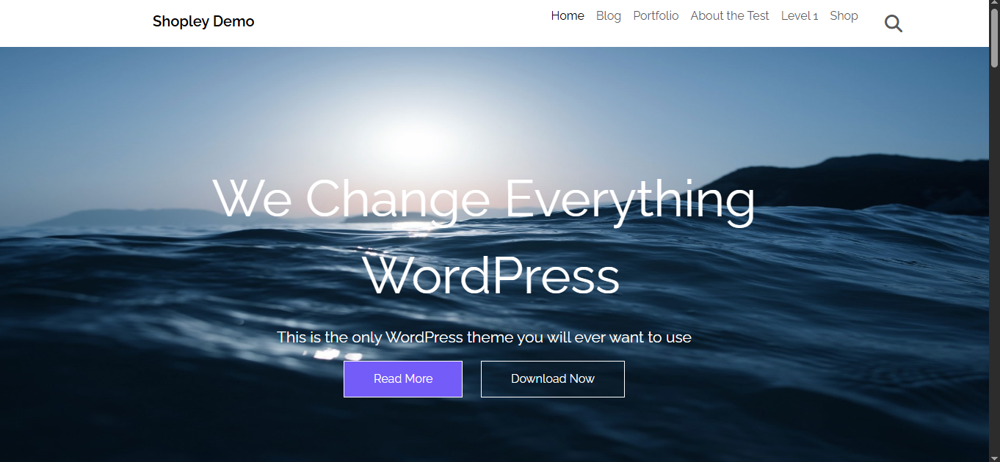
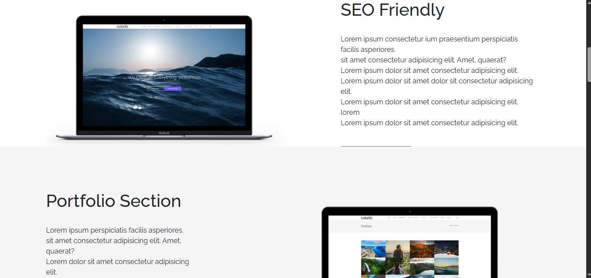
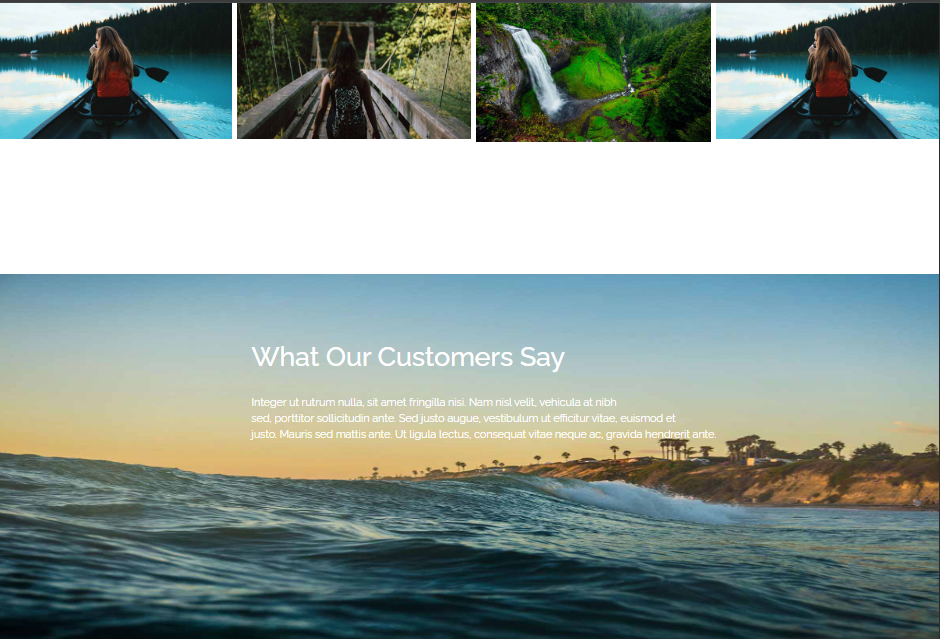

# 🌐 Shaply Demo Frontend Template

A **fully responsive one-page website template** inspired by the **Shaply theme**.  
Built using **HTML**, **CSS**, **Bootstrap**, and **Font Awesome**, this template represents a modern business or portfolio landing page design.

---

## 🖼️ Project Overview

The **Shaply Demo Frontend** includes all key sections you’d expect in a professional one-page site:

- 🏠 **Hero Section:** Catchy headline, subtext, and a call-to-action button.  
- 💼 **Features Section:** Responsive grid layout showing key features or services.  
- 📸 **Portfolio Section:** Showcase of projects or products using Bootstrap cards/grid.  
- 👨‍💻 **About / Team Section:** Information and team cards.  
- 📞 **Contact Section:** Styled contact form and footer with social icons.

All sections are mobile-friendly and adapt beautifully across screen sizes.

---

## 🛠️ Built With

- **HTML5** – Semantic markup  
- **CSS3** – Custom styling  
- **Bootstrap 5** – Responsive grid and layout system  
- **Font Awesome** – Icon library  
- **Google Fonts** – Typography styling  

---

## 🧠 Key Learning

This project helped me understand:
- Responsive web design with Bootstrap grid system  
- Landing page structure and layout hierarchy  
- Combining custom CSS with Bootstrap for unique design  
- Using Font Awesome icons for modern UI aesthetics  








---

## 🚀 How to Run the Project

1. Clone this repository:
   ```bash
   git clone https://github.com/<your-username>/shaply-demo-frontend.git
